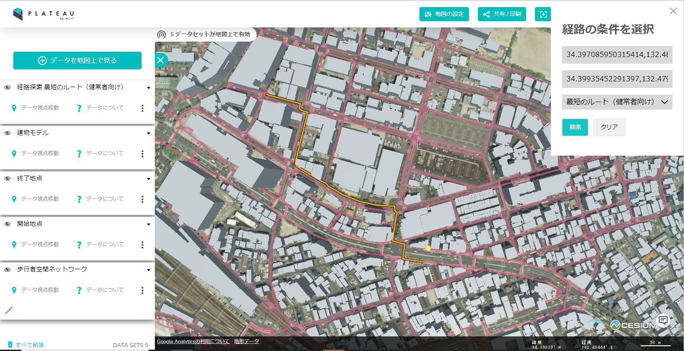
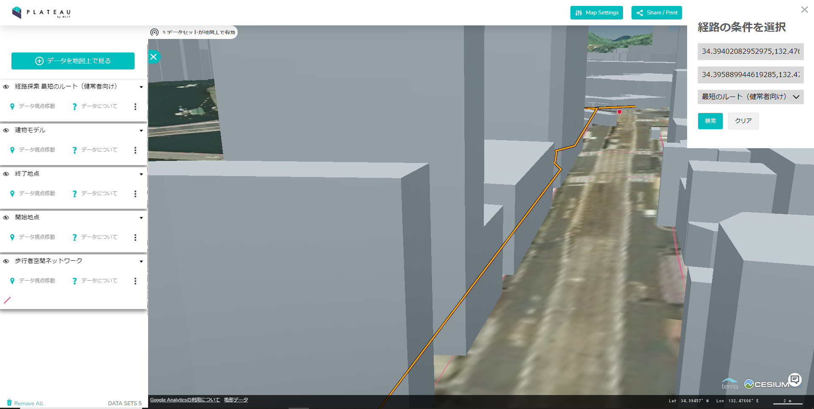

# PLATEAU-Terria-web-app
本リポジトリでは、「Terriaを用いたPLATEAU VIEWでの経路検索Webアプリ」を利用すると実際にどのようなアプリケーションが作れるかについて知るためのサンプルプロジェクトを公開しています。




## はじめに
国土交通省Project PLATEAU公式YouTubeに[「Terriaを用いたPLATEAU VIEWでの経路検索Webアプリの作り方」](https://www.youtube.com/watch?v=Us73IbVsbDc)のハンズオン動画を公開しています。
導入方法、機能の説明、サンプルプロジェクトの内容等について解説していますので、初めて触る方はまずはこちらをご覧ください。

## 開発環境
- 開発環境は以下を使用してください。
    - OS: Windows10, 11
    - メモリ: 16GB～
- 本リポジトリのサンプルプロジェクトはDocker上で稼働するLinux Ubintu22.04上に構築する構成となっております。開発環境上でWSL2を有効化し、Docker Desktopのインストールを行ってください。
    - 参考サイト: [Windows＋WSL2でDocker環境を用意しよう](https://www.kagoya.jp/howto/cloud/container/wsl2_docker/)
- プロジェクト構築にあたり、開発環境に以下のツールをご用意ください。

| ツール名 | 概要・用途 | 参考サイト |
| ------- | ---- | --------- |
| QGIS | オープンソースのGISソフトウェア。歩行空間ネットワークデータの変換・インポートに使用します。| https://qgis.org/ |
| pgAdmin | PostgreSQLを操作するクライアントツール。構築手順中のSQL実行時に使用します。 |  https://www.postgresql.org/ftp/pgadmin/ |
| Anaconda | 経路探索のコスト計算に使用するpythonプログラムの動作環境として使用します。 | https://www.anaconda.com/ |
| Spring Tools 4 | 経路探索WebAPIのソースコード編集やwarファイルのビルドに使用します。 | https://spring.io/tools |
- 詳細な構築手順は[こちら](./plateauhands-on-07.pdf)をご参照ください。
- Git for Windows で本リポジトリのチェックアウトを行う場合、デフォルトでは改行コードがLF→CRLFに変換されるため、/Settings/docker/startup.sh が正常に動作しない場合があります。以下いずれかの方法で該当ファイルの文字コードをLFとしてください。
    - Gitのチェックアウト時に文字コードが変換されないように以下コマンドで設定を変更します。
        ```
        git config --global core.autocrlf false
        ```
    - 上記の変更が行えない場合、startup.shを開いて文字コードを確認し、CRLFとなっている場合はLFに変更します。


## ライセンス
- ソースコードおよび関連ドキュメントの著作権は国土交通省に帰属します。
- 本ドキュメントは[Project PLATEAUのサイトポリシー](https://www.mlit.go.jp/plateau/site-policy/)（CCBY4.0および政府標準利用規約2.0）に従い提供されています。

## 注意事項
- 本レポジトリは参考資料として提供しているものです。動作保証は行っておりません。
- 予告なく変更・削除する可能性があります。
- 本レポジトリの利用により生じた損失及び損害等について、国土交通省はいかなる責任も負わないものとします。
