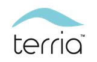

# Terria Map



[](https://greenkeeper.io/)

こちらは、PLATEAU VIEWで実現した機能を含む、Terria Mapのパッケージです。Terria Mapは、TerriaJSライブラリを用いたwebシステムとなります。TerriaJSの概要は、 [TerriaJS README](https://github.com/TerriaJS/TerriaJS) を参照ください。

本パッケージの使い方は、「実証環境構築マニュアル」および 下記の手順の文書を参照ください。

## 使い方

### ローカル開発環境での起動方法

#### 前提と事前準備

作業マシンに下記をインストールして下さい。

- Node.js v10.0 以降
- npm v6.0 以降
- yarn v1.19.0 以降


#### 手順

##### TerriaMapのクローン

```bash
git clone git@github.com:Project-PLATEAU/PLATEAU-VIEW.git TerriaMap
cd TerriaMap
```

##### TerriaJsのクローン

```bash
mkdir packages && cd packages
git clone git@github.com:Project-PLATEAU/terriajs.git terriajs
cd ../../
```

#####  nodejs依存モジュールのインストール

```bash
export NODE_OPTIONS=--max_old_space_size=4096
yarn
```

##### PlateauViewのビルド

下記コマンドを実行すると、PlateauViewがビルドされます。

```bash
yarn gulp
```

または、下記コマンドを実行すると、PlateauViewがビルドされます。

```bash
yarn gulp release
```

下記コマンドを実行するとソースコードの変更が自動的にビルドに反映されます。
Ctrl + cで停止します。

```bash
yarn gulp:watch
```

##### PlateauViewの起動

下記コマンドを実行します。上の手順で`yarn gulp:watch`を実行した場合は、別のターミナルで実行します。

```bash
yarn start
```

ブラウザで http://localhost:3001 を開くと、PlateauViewを見ることができます。

##### PlateauViewの停止

下記コマンドを実行します。

```bash
yarn stop
```

### デプロイの方法

#### 前提と事前準備

ここでは、AWS(Amazon Web Service)を使用を前提としています。

作業マシンに下記をインストールして下さい。

- Node.js v10.0 以降
- npm v6.0 以降
- yarn v1.19.0 以降
- awscli（筆者はv2.2.29で動作を確認）

下記のようにAWSのプロファイルを用意してください。このプロファイル名を後述の設定に使用します。

```text
# ~/.aws/config

[profile terria]
aws_access_key_id=YOUR_ACCESS_KEY
aws_secret_access_key=YOUR_SECRET_ACCESS_KEY
```

また、AWSの管理コンソールなどで、下記を用意して下さい。

- AWS Route53のHosted Zone
- EC2のキーペア
- AWS SSL Certificate （AWS Certification Managerで作成、またはインポートする）
- アプリケーションパッケージをアップロードするためのAWS S3バケット（アプリケーションのインストールは、作業PCからAWS S3バケットにからパッケージをアップロードし、そのパッケージをEC2インスタンスがダウンロードすることによって行われます。）

#### 手順

##### TerriaMapのクローン

```bash
git clone git@github.com:Project-PLATEAU/PLATEAU-VIEW.git TerriaMap
cd TerriaMap
```

##### TerriaJsのクローン

```bash
mkdir packages && cd packages
git clone git@github.com:Project-PLATEAU/terriajs.git terriajs
cd ../../
```

##### TerriaMap/package.jsonの編集

`TerriaMap/package.json`の`packageName`、`awsProfile`、`awsS3PackagesPath`、`awsRegion`、`awsEc2InstanceType`、`awsEc2ImageId`、`awsKeyName`を変更します。

```json
//変更前
 "config": {
    "packageName": "<PACKAGE NAME>",
    "awsProfile": "<AWS PROFILE>",
    "awsS3PackagesPath": "<YOUR AWS S3 PATH TO STORE YOUR PACKAGE>",
    "awsRegion": "<AWS REGION>",
    "awsEc2InstanceType": "<AWS EC2 INSTANCE TYPE>",
    "awsEc2ImageId": "<AWS EC2 AMI ID UBUNTU>",
    "awsKeyName": "<AWS EC2 KEY PAIR NAME>",
```

各項目の内容は次のとおりです。
| 項目名 | 内容 |
| :-- | :-- |
| packageName | アプリケーションのパッケージ名 |
| awsS3PackagesPath | アプリケーションのパッケージを保管するS3のパス |
| awsRegion | AWS のリージョンID |
| awsEc2InstanceType | EC2のインスタンスタイプ |
| awsEc2ImageId | EC2のAMIのID （Ubuntu 18.04）|
| awsKeyName | EC2のキーペア|

```json
//変更例
 "config": {
    "packageName": "plateuveiw",
    "awsProfile": "terria",
    "awsS3PackagesPath": "s3://my-great-bucket/viewer",
    "awsRegion": "ap-northeast-1",
    "awsEc2InstanceType": "t3.small",
    "awsEc2ImageId": "ami-00bc9b7f0e98dc134",
    "awsKeyName": "my-great-key-pair",
```

##### TerriaMap/deploy/aws/stack.json の編集

`TerriaMap/deploy/aws/stack.json` の `Parameters.HostedZoneName.Default`と`SSLCertificateId`を編集します。

各項目の内容は次のとおりです。
| 項目名 | 内容 |
| :-- | :-- |
| Parameters.HostedZoneName.Default | Route53のHosted Zone |
| SSLCertificateId | AWS SSL CertificateのARN |


##### nodejs依存モジュールのインストール

```bash
git config url."https://github.com/".insteadOf git://github.com/
yarn
```

##### インフラ構築とデプロイ

```bash
export NODE_OPTIONS=--max_old_space_size=4096
yarn deploy-without-reinstall
```
